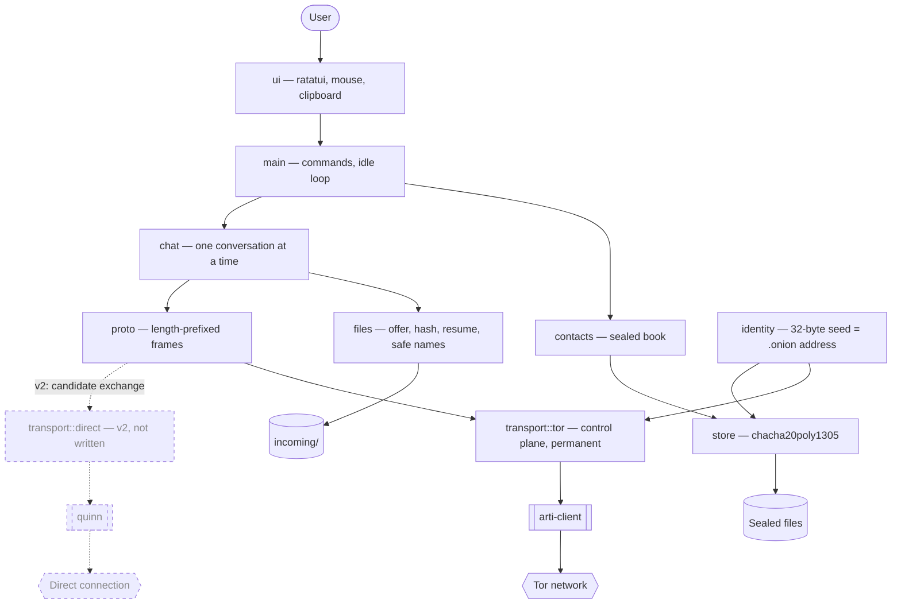

# INSTALL.md — murmure

Technical vision and installation guide.

**Date**: 2026-07-31, revised 2026-08-01
**Status**: **v1 shipped on macOS and Linux.** Windows does not work — arti hangs
on its first consensus, see `aidd_docs/arti-windows-hang.md`.
**Upstream source**: `aidd_docs/brainstorm/2026_07_30-messagerie-pair-a-pair-terminal.md`

> This document was written before the first line of code. The **Decisions**,
> **Audit summary** and **What choice C costs** sections describe the original
> reasoning and remain accurate; they are kept as an archive. The **Stack
> summary**, **Architecture**, **Folder structure** and **Install steps**
> sections describe the real code and were corrected on 2026-08-01. Where
> reality contradicted the plan, it is marked in place rather than silently
> rewritten — a plan whose mistakes are erased teaches nothing on a second
> reading.

---

## Vision

> Encrypted peer-to-peer terminal messaging. No server, no account, no
> centralized metadata.

murmure lets two people who already know each other talk machine to machine,
with no intermediary able to read the messages **or learn who talks to whom**.
That second point is what defines the project: end-to-end encryption is settled
everywhere, Signal and WhatsApp included; confidentiality of the **social graph**
is settled nowhere.

The differentiator fits in one sentence: no company can shut the service down,
bill for it, or change its terms — because there is no service, only two
machines and a public network. Target: technical circles of friends, fewer than
ten users, zero cost, permanently.

---

## Decisions

| Decision | Choice | Why |
| --- | --- | --- |
| Architecture | Monolith, **a single binary crate**, with a `Transport` trait and two implementations | One solo developer, fewer than ten users. The only abstraction laid down is the transport one, because there really will be two implementations — not a speculative interface. |
| **Control / data separation** | **Tor carries control, a direct channel carries data** | Tor's throughput (0.1-0.25 MB/s) is inconsequential for text and disqualifying for files. Decoupling the two means paying the price of anonymity where it buys something, and not elsewhere. Restores the three-path ladder from the brainstorm. |
| Language | **Rust** (MSRV 1.91) | The only language known here that gives all of a native Tor ecosystem, a single cross-OS binary, and no runtime for the other person to install. |
| Interface | **ratatui + crossterm**, TUI | The "rich text mode, no graphical window" requirement. crossterm covers Windows, which answers the reservation raised about that OS. ⚠️ **Contradicted on 2026-08-01, but not by crossterm**: the TUI renders correctly under Windows Terminal; it is arti that hangs before that. |
| Transport — control plane | **arti** — Tor v3 onion service (`arti-client`, `onion-service-service` feature) | The only one of the three candidates that does not betray the metadata goal. It also removes the NAT problem entirely, including on 4G/CGNAT. Carries discovery, authentication, presence and **all text**. ✅ Verified on 2026-08-01 between macOS and Linux, on the same network **and** over a 5G tether — so two NATs and two different ISPs. |
| Transport — data plane | **`quinn`** (raw QUIC), on demand, **v2** | For files and images only. Candidates are exchanged over the already-authenticated Tor channel, then a direct connection at full speed. Failure ⇒ fall back to Tor, slow but working. |
| Identifier → address directory | **Tor's distributed directory (HSDir)** | Settles the last technical unknown from the brainstorm without hosting anything. v3 descriptors are blind-encrypted: a directory cannot enumerate the services it relays. |
| Identity | **ed25519 key = v3 `.onion` address**, a 32-byte seed owned by murmure, deposited in the arti keystore (`ArtiNativeKeystore`) | The "identifier derived from the key, unforgeable" requirement is not something to implement: it is the definition of a v3 onion address. ✅ Settled 2026-07-31: murmure **supplies** its key to arti through `launch_onion_service_with_hsid`, it does not read it. See "Ownership of the identity key — settled". |
| Peer authentication | **Restricted discovery** (Arti ≥ 1.7.0), **x25519** client keys | An onion service authenticates the server but not the client. Restricted discovery limits even *descriptor retrieval* to authorized contacts: "friends only" becomes a property of the transport. |
| Transfer integrity | ~~`bao-tree`~~ → **BLAKE3 of the whole file** | ❌ **Reversed on 2026-08-01, while writing `files.rs`.** Verified streaming defends against a source you did not choose; here the stream is an onion circuit that is already encrypted and authenticated, and the peer is authenticated by the `.onion` address compared out loud. A sender who wanted to send bad bytes would simply offer a different file. What was actually needed is integrity against corruption plus a **transfer identity** to resume at the right place: a hash of the whole file gives both, with no extra dependency. The partial file is named after that hash, which makes splicing two different files together structurally impossible. Full reasoning at the top of `src/files.rs`. |
| Channel encryption | **No added layer** — Tor's own (ntor v3) | A deliberate decision. Stacking Noise on top of an onion circuit adds a surface for mistakes with nothing gained: home-made crypto is excluded, and a home-made composition of audited primitives is a form of it. |
| Local storage | **`chacha20poly1305`-encrypted files**, no DBMS | A book of fewer than ten contacts and one history per conversation. SQLite would be a dependency for what a sealed file does. |
| Hosting | **None** — the Tor network, €0/month, permanently | A hard constraint. No server operated, no account, no invoice possible. |
| Distribution | A single binary **and** `cargo install` | Rust makes the trade-off moot: both come out of the same build. |

---

## Stack summary

The real state of `Cargo.toml` as of 2026-08-01. Every dependency there carries
the comment saying why it is there — this table is only an index to them.

| Layer | Crate / tech | Real version |
| --- | --- | --- |
| Control transport & directory | `arti-client` (features `onion-service-service`, `onion-service-client`, `experimental-api`, `restricted-discovery`, `static-sqlite`, `rustls`) | **=0.44.0**, pinned |
| arti crates named directly | `tor-hsservice`, `tor-hscrypto`, `tor-llcrypto`, `tor-keymgr`, `tor-cell`, `tor-rtcompat` | **=0.44.0**, pinned |
| Async runtime | `tokio` | 1.x, `full` feature |
| Terminal interface | `ratatui` + `crossterm` | ratatui **0.30.2** / crossterm **0.29** (`event-stream`) |
| Identity | ~~`ed25519-dalek`~~ → `tor-llcrypto` | Never added: arti already re-exports ed25519 and curve25519, and a second copy of dalek in the tree would mean two incompatible types for the same key. |
| Encryption at rest | `chacha20poly1305` | **0.11**, `zeroize` feature |
| Memory wiping | `zeroize` | 1.x — already pulled in by arti, so free |
| File integrity | ~~`bao-tree`~~ → `blake3` alone | See the "Transfer integrity" row of the decisions. |
| Clipboard | `data-encoding` | 2.x — base64 for OSC 52, already pulled in by arti |
| Protocol serialization | `serde` + `postcard` | 1.x / 1.x |
| Logging | `tracing` + `tracing-subscriber`, `safelog` | to a file, never stdout — the TUI owns the screen |
| Data transport (v2) | `quinn` + `rcgen` | **0.11 / 0.14**, `ring` feature on both. Shipped 2026-08-02: `/send --direct`, explicit. |
| Compiler | Rust stable | **≥ 1.91** (MSRV imposed by arti 0.44) |

> **`static-sqlite` was not planned and is not optional.** `tor-dirmgr` caches
> the consensus in SQLite; without this feature, linking fails on Windows
> (`LNK1181: cannot open sqlite3.lib`, there is no system SQLite) and on a bare
> Linux without `libsqlite3-dev`. Costs a minute of C compilation and buys one
> build recipe on all three operating systems.

> **`rustls` rather than `native-tls`**, for a reason that belongs to the
> project and not to convenience: native-tls is schannel on Windows,
> Security.framework on macOS, OpenSSL on Linux — so the TLS ClientHello
> announces the operating system. For a tool whose reason to exist is that
> nobody learns who talks to whom, having the transport layer volunteer what you
> run goes against the grain. rustls makes every murmure look alike.

**External integrations**: the Tor network, and nothing else. No paid service,
no third-party account, no server to operate.

> ⚠️ **Pin the arti versions strictly.** The arti crates are `0.x` with a
> **monthly** release cadence and API breaks at every bump. Write
> `arti-client = "=0.44.0"`, not `"0.44"`. Budget half an evening of migration
> for every deliberate bump.

> ⚠️ **Known migration cost: `experimental-api`.** The keystore milestone forced
> two extra features onto `arti-client` — `onion-service-client` (required to
> dial a `.onion` address) and **`experimental-api`**, which alone exposes
> `launch_onion_service_with_hsid`. An experimental feature offers no stability
> guarantee, not even between two minor versions: it can disappear or change
> signature at the next bump. The debt is bounded on purpose — one call, in one
> function (`transport::tor::launch_with_identity`), documented as the pivot
> point to route B, which uses only stable API (`ArtiNativeKeystore`,
> `KeyMgrBuilder`, `KeyMgr::insert`, `launch_onion_service`). At every arti
> bump: check that call first.
>
> Neither feature added a crate to the graph: `tor-hsclient` and `tor-hscrypto`
> were already resolved. arti's experimental features are plain cargo features —
> no `RUSTFLAGS`, no `--cfg`, no `.cargo/config.toml`.

---

## Architecture

As built. Dashed is what was planned and not written.



> ⚠️ **The dashed part is no longer dashed.** `transport::direct` was written on
> 2026-08-02 — see the v2 row of the transport roadmap. The diagram is kept as
> it was drawn, per this document's rule: what reality contradicted is marked,
> not overwritten.

The structuring boundary runs between `proto` and `transport`. `proto` knows
only serialized frames and an identified peer; `transport::tor` knows only bytes
and an address. So the boundary is exactly where it was planned — but it is held
by the discipline of the signatures, not by a trait. See "Folder structure".

**The Tor control plane is permanent and carries everything**: discovery,
authentication, presence, text messages, and negotiation of the data plane.
**The direct data plane is opened on demand, for files only**, then closed. That
asymmetry is the heart of the architecture: the price of anonymity is paid where
it costs nothing (a few hundred bytes per message) and avoided where it hurts
(megabytes).

`identity` is the root: the ed25519 key produces the `.onion` address, hence the
public identifier. Losing the machine still means losing the identity, as
assumed at the brainstorm.

### Ownership of the identity key — settled

> ✅ **Reservation lifted on 2026-07-31, in code and at runtime.** The program
> **can** supply its own ed25519 key to arti. `identity` therefore remains the
> root of the architecture as drawn above: murmure owns the seed, arti is only
> its consumer. The alternative branch — inverting the dependency and *reading*
> the key from the keystore — is abandoned.

**The API.** `TorClient::launch_onion_service_with_hsid(config, id_keypair: HsIdKeypair)`
(`arti-client-0.44.0/src/client.rs:1998`), behind the `onion-service-service` +
`experimental-api` features. It calls
`KeyMgr::insert::<HsIdKeypair>(kp, &HsIdKeypairSpecifier::new(nickname), KeystoreSelector::Primary, false)`
and then delegates to `launch_onion_service`. That `false` is an `overwrite`:
arti **refuses to overwrite** an existing key, which is exactly the wanted
behaviour.

**Why arti then generates nothing.** `tor_hsservice::maybe_generate_hsid`
(`tor-hsservice-0.44.0/src/lib.rs:586`) looks up `HsIdPublicKeySpecifier` first
and only generates if that lookup is empty. `KeyMgr::get_from_store`
(`tor-keymgr-0.44.0/src/mgr.rs:566-583`) falls back to the *keypair* specifier
when the public key is absent. The inserted key is therefore found, and arti
logs `Using existing identity for service murmure` — verified at runtime.

**The conversion chain**, entirely inside the arti crates, with no home-made
cryptographic code:

```
[u8; 32] seed  ->  ed25519::Keypair  ->  ed25519::ExpandedKeypair  ->  HsIdKeypair
                                                                   ->  HsIdKey -> HsId (.onion)
```

`HsIdKeypair` is a newtype over `ExpandedKeypair` (`tor-hscrypto-0.44.0/src/pk.rs:81`),
and `ExpandedKeypair: From<&ed25519::Keypair>` (`tor-llcrypto-0.44.0/src/pk/ed25519.rs:237`).

**The proof relied on is not a log line** but a byte comparison: `identity.rs`
computes the `.onion` address locally from the seed, without ever touching the
keystore, and the program aborts loudly if the address arti publishes differs
from it.

**Route B, held in reserve.** Build an
`ArtiNativeKeystore::from_path_and_mistrust(<state_dir>/keystore, permissions)`
plus a `KeyMgrBuilder`, insert under `HsIdKeypairSpecifier`, then call the
non-experimental `launch_onion_service`. arti-client builds its own keystore at
exactly `<state_dir>/keystore` (`arti-client-0.44.0/src/client.rs:320-350`), so
the two agree on disk. The whole rework fits in the body of a single function,
`transport::tor::launch_with_identity`.

**A trap found at runtime.** `KeyMgr::insert` with `overwrite = false` returns
`KeyAlreadyExists` as soon as the keystore already holds a key for that nickname
— **including our own**, on the second launch. This is not an error:
`launch_with_identity` catches it and publishes on the stored key. It is the
byte comparison, and only it, that distinguishes "this is indeed our key" from
"somebody else occupies that nickname".

---

## Folder structure

Real as of 2026-08-01. The original plan is kept below, with what contradicted
it.

```
murmure/
├── Cargo.toml                  # one crate, arti versions pinned with "="
├── src/
│   ├── main.rs                 # typed commands, idle loop, publication
│   ├── identity.rs             # 32-byte seed, .onion address, discovery key
│   ├── transport/
│   │   ├── mod.rs              # no Transport trait — says why (see below)
│   │   └── tor.rs              # arti: publish, authorize, dial
│   ├── proto.rs                # length-prefixed frames: text, offer, chunk, ping
│   ├── chat.rs                 # one conversation: keyboard, receive, transfer
│   ├── contacts.rs             # sealed book, addresses + discovery keys
│   ├── files.rs                # offer, hash, resume, safe names, display cleanup
│   ├── store.rs                # chacha20poly1305 sealing on disk
│   ├── onion.rs                # address and key validation, short fingerprint
│   └── ui.rs                   # ratatui: history, input, mouse, clipboard
└── aidd_docs/
    ├── INSTALL.md
    ├── arti-windows-hang.md    # upstream bug report, ready to file
    └── brainstorm/
        └── 2026_07_30-messagerie-pair-a-pair-terminal.md
```

Three departures from the plan, all deliberate:

- **`ui/` was not split into three files.** `ui.rs` fits in one file and talks
  to only two channels; splitting it into `mod.rs` + `chat.rs` + `contacts.rs`
  would have created three files for a single render loop.
- **`history.rs` does not exist.** Nothing is kept between two launches. The
  sealed mode remains possible — `store.rs` is written for it and the book
  already uses it — but until somebody asks for it, writing nothing to disk is
  the best confidentiality property available, not a gap.
- **`tests/loopback.rs` does not exist.** The real integration tests live in
  `chat.rs`: two conversations over an in-memory duplex, reacting to what
  appears on screen rather than to pre-programmed keystrokes. They found two
  genuine concurrency bugs that a loopback round-trip would not have seen.

**And above all: the `Transport` trait is not written.** It was "the project's
only abstraction"; it is waiting for its second implementation to exist. An
interface with a single implementation factors nothing out, it only moves code
from one file to another. `transport/mod.rs` carries that decision in plain
words so the next reading does not mistake it for an oversight.

---

## Transport roadmap

Tor's throughput is inconsequential for text and painful for files. Rather than
building everything at once, the ladder is climbed in steps, each one
shippable.

| Step | Content | What it covers | Effort |
| --- | --- | --- | --- |
| **v1** | **Tor alone.** Fluid text, slow but working files. | Everyone, everywhere, 4G and CGNAT included. | The bulk of the work |
| **v2** | ✅ **Done on 2026-08-02, but not as planned.** The plan said "**silent** fallback" and automatic; that is corrected. A direct path that turns itself on leaks the relationship without anyone noticing — both ISPs see those two addresses exchanging data. So: explicit `/send --direct`, file by file, and it is the recipient's `/accept` that opens the port, after being told what that exposes. Refusing the route without refusing the file remains possible. | **IPv6: any two networks. IPv4: the local network only.** The plan announced "full-cone NAT, UPnP, port forwarding" and had the wrong problem. The real obstacle on IPv4 is not NAT but the fact that a machine behind one **cannot learn its own public address** without a third party — that is what STUN exists for. On IPv6 the question does not arise: the global address sits on the interface, there is nothing to discover. `candidates()` therefore announces it first, and both QUIC endpoints listen on `[::]` to be reachable from both families. What is left is the router's inbound firewall, which is a rule and not a translation. UPnP/NAT-PMP was tested on the author's network: no answer, on both machines. | A weekend |
| **v3** | **NAT hole punching** by timed simultaneous open. Mutual address reflection: each side sends back over Tor the source address it observed, ICE-style — no STUN, no third party. | Most restrictive NATs. Never symmetric NAT. | This is where the real difficulty is |

All the complexity is concentrated in v3, and v2 is relieved of it. Do not build
it before measuring that v2's failure rate is a real nuisance.

**What makes this arrangement possible with no server at all**: the Tor control
plane is already an authenticated signalling channel between the two peers. That
is precisely the service a third-party relay (iroh/n0, TURN, DERP) usually
provides — so having it, they are no longer needed.

> **Explicitly rejected**: self-hosting a relay (`iroh-relay` on a VPS) to
> recover public address discovery. That reintroduces a server to operate, a
> monthly cost, and a single point of failure — the constraint the project
> exists to remove.

> **Explicitly rejected**: using `iroh` with `RelayMode::Disabled` as the data
> plane. Once its relays and its discovery are disabled, what remains of iroh is
> `iroh-blobs`, paid for with a second `0.x` API laid on a stack half of whose
> mechanisms are being neutralized. `bao-tree` alone gives the property being
> sought — block-by-block verification — without that cost.
>
> ⚠️ **The rejection of iroh still stands, but its fallback argument has
> collapsed**: `bao-tree` was dropped in turn while writing `files.rs` (see the
> decisions). The "block-by-block verification" property turned out not to be
> the one murmure needed — what was needed was a transfer identity for resuming.
> iroh remains excluded on its original ground, which is a design one and not a
> technical one: the relay observes who talks to whom.

---

## Install steps

Manual installation — this document generates no files.

1. **Install Rust ≥ 1.91**: `rustup toolchain install stable && rustup default stable`,
   then check with `rustc --version` (arti 0.44 imposes 1.91 as its MSRV).
2. **Initialize the crate**: `cargo init murmure --bin` at the root of the
   existing repository.
3. ~~**Add the dependencies**~~ — the real list diverged from this one; see
   "Stack summary", or more simply `Cargo.toml`, which carries the why of every
   line. What remains true: **pin arti exactly** (`=0.44.0`, not `0.44`).
4. **Check that it compiles on all three target operating systems** before
   writing a single line of logic. arti pulls in a substantial dependency chain;
   discovering a Windows build problem after three evenings of code is
   expensive. Note: docs.rs reports a build failure for `arti-client` 0.44.0
   (0.43.0 is the last version that builds there) — most likely an artifact of
   their sandbox, but to be confirmed with a local `cargo build`.
5. ~~**Settle the keystore question.**~~ ✅ Done 2026-07-31: the program supplies
   its own key, `identity.rs` really is the root of the architecture. See
   "Ownership of the identity key — settled".
6. ~~**First executable milestone.**~~ ✅ Crossed 2026-07-31. `cargo run`
   publishes the onion service under a key generated by murmure, prints the
   `.onion` address, and a second `TorClient` on the same machine connects to it
   and receives its echo. About 9 s cold on already-bootstrapped state, 23 s on
   a clean machine. Plan and acceptance criteria:
   `aidd_docs/tasks/2026_07/2026_07_31-keystore-onion-milestone.md`.
7. ~~**Second milestone**~~ ✅ **Crossed 2026-08-01.** The brainstorm's success
   criterion is met: two machines (macOS and Linux), fingerprint compared out
   loud, messages, then a file with the recipient's explicit consent and resume
   after a drop. Verified on the same network **and** over a 5G tether, so two
   NATs and two ISPs. Restricted discovery was validated right after: the
   service reconfigures itself live on the first `/add`, with no restart.

**To install and use murmure, this document is no longer the right place**:
`README.md` covers usage. The steps above are kept as a record of the order in
which the project was built.

### What v1 actually ships

- A v3 onion service under a key owned by murmure, address verified by byte
  comparison against the seed.
- **Restricted discovery**: with no contacts, the service is visible to whoever
  has the address; at the first `/add`, the descriptor becomes unreadable to
  anyone but the authorized contacts. Switches live.
- Text conversation, one call at a time, with a short fingerprint to compare.
- **File transfer** with the recipient's explicit consent, resume after a drop
  indexed by the hash, and verification before giving the file its real name.
- TUI: scrollable history, drag and drop, `Ctrl-V`, mouse selection copied on
  release, `/copy` via OSC 52.

### Security posture, beyond the transport

Three defences that were not in the plan and had to be written:

- **A peer's filename is a trust boundary.** It becomes a path on disk, so
  `files::safe_name` throws away every path component and refuses control
  characters and Unicode bidi overrides — a `U+202E` makes `innocentexe.png`
  read as such while remaining an executable.
- **A peer's text is one too.** It goes to a terminal, which obeys escape
  sequences: a raw ESC allows overwriting the other side's clipboard through OSC
  52. Cleaned by `files::sanitize_for_display`.
- **The seed and the keys derived from it are wiped on drop** (`zeroize`),
  including the decrypted book, which is the social graph in the clear.

None of these three was visible from the plan: they come from an audit carried
out once the code was written.

---

## Audit summary

Result of the audit carried out at action 03.

| Candidate | Verdict | Note |
| --- | --- | --- |
| **A. iroh** (QUIC + hole punching + n0 relays) | ⚠️ | `iroh-blobs` offers resumable transfer, but the relay observes who talks to whom — the very metadata the project exists to hide — and it is operated by a company. |
| **B. rust-libp2p** (Noise + Kademlia + DCUtR) | ❌ | A DHT with fewer than ten nodes does not work; falling back to the public IPFS DHT publishes the social graph in a worldwide directory that crawlers harvest and republish. |
| **C. arti / onion v3** | ⚠️ | **Chosen.** Holds the metadata goal, removes the directory unknown, cancels the NAT problem — at the price of a dial latency and a throughput far heavier than first estimated. No blockers. |

**Scope of the audit, honestly**: candidates B and C were the subject of an
independent audit carried out by an agent, with sources. Verdict A rests on
direct judgement, unaudited — with no consequence, since A is excluded on a
design criterion (the relay observes the social graph) and not on a contestable
technical point.

C's verdict went from ✅ to ⚠️ after the audit: the reservations are real and
quantified below, but none is disqualifying, and the choice remains the only one
of the three compatible with the project's reason to exist.

### What NAT becomes with an onion service

A design point worth making explicit, because it is counter-intuitive: **an
onion service never accepts an inbound connection**. The service opens
*outbound* circuits to its introduction points, publishes its descriptor
*outbound*, and meets its correspondent at a rendezvous point both reach *going
out*. The two halves meet in the middle.

Consequence: CGNAT, symmetric NAT, 4G/5G, public wifi, corporate network — if
outbound TCP gets through, murmure gets through. The brainstorm's "the direct
path will not work for everyone" risk disappears, along with any need for NAT
traversal, hole punching and fallback relays. Only a network blocking Tor itself
by packet inspection is a problem: the recourse there is bridges and pluggable
transports, configured by hand.

### What choice C costs, quantified

These figures come from the 2026-07-31 audit and **correct an initial estimate
that was too optimistic** (1 to 3 s, wrongly announced). They weigh on the
**control plane**; the direct data plane (v2) routes around them for files.

- **Dial: 7 to 50 s, 13 to 20 s on average** (PETS 2025). The circuit is six
  relays — three client-side, three service-side, rendezvous included. That is
  the cost of opening a conversation, **not** the cost of a message: once the
  circuit is up, messages go through in under a second. The "phone call" model
  holds, but the ring is long and the TUI has to show it plainly rather than
  appear frozen.
- **Throughput: 0.1 to 0.25 MB/s**, ceiling around 0.5 in good conditions.
  Onion-to-onion traffic suffers from less mature congestion control than the
  rest of the network. A 5 MB photo takes a minute, a 100 MB file takes an hour.
  In exchange, this traffic crosses no exit node: it does not consume Tor's
  scarce and contested resource, and the use is legitimate. **To keep in
  perspective**: a text message is a few hundred bytes, so that throughput
  carries more than a thousand of them per second. Messaging is not throttled —
  only files are, and that is what the direct data plane (v2) corrects.
- **Circuits are recyclable.** Tor applies its own expiry and rotation policies.
  Design for frequent reconnections, never for a permanent channel. Combined
  with the throughput above, this makes transfer resume **structurally
  mandatory** — a transfer of a few tens of MB has a good chance of being
  interrupted at least once.
- **Presence: no cheap ping exists.** Knowing whether a contact is reachable
  requires a full circuit, so 7 to 50 s per contact. The brainstorm's "presence
  indicator from v1" is far more expensive than assumed. A lead: show presence
  only for conversations that are already open (an application-level heartbeat
  on an established circuit, free), and replace the rest with an explicit "call"
  action. To be settled at design time.
- **First contact heavier than expected.** The identifier to exchange is not
  only the `.onion` address: restricted discovery adds an **x25519** client key,
  and the exchange is **asymmetric** — each side has to record the other's key
  in its `authorized_clients`. To check that the whole thing remains comparable
  out loud as a short fingerprint.
- **A single network path in v1.** The brainstorm's direct → assisted → relayed
  ladder becomes a v2. If Tor is blocked on the user's network, bridges are
  required.

### The two traps that will cost an evening

Historic trap number 1 — importing a custom ed25519 key into the arti keystore —
has been lifted since 2026-07-31; it cost an evening, as predicted. What
remains:

1. **The absence of a cheap presence mechanism** — to be budgeted into the TUI's
   UX from the start, not patched in later.
2. **Throughput combined with recyclable circuits** — segmentation and resume
   have to be in the initial design of `files.rs`.

### What remains open after this document

- ~~**Transfer resume across sessions**~~ ✅ **Solved 2026-08-01**, and without
  the planned mechanism. No state journal, no list of received blocks: the
  partial file is **named after the BLAKE3 hash of the whole file**, with a
  `.part` extension. Its size *is* the resume state, and a partial carrying a
  given hash can only be a prefix of the file that has that hash — so splicing
  two different files together is structurally impossible rather than forbidden
  by a check. Nothing to record, nothing to clean up, nothing to corrupt.

- ⚠️ **Windows does not work.** arti hangs while downloading its first
  consensus, one core at 100 %, on **two independent machines and two
  networks**, with the standalone `arti` CLI as well as with `arti-client`
  embedded. Seven hypotheses eliminated with evidence (network, clock, TLS,
  compression, application code, lock contention, congestion control #2651).
  Root cause not found: it would take attaching a native debugger to see which
  thread is spinning. Upstream report written and ready to file —
  `aidd_docs/arti-windows-hang.md`. Until then, murmure is macOS and Linux.
- **Tuning the cost of presence**, now quantified as the project's real UX
  problem. A complication found at the keystore milestone:
  `OnionServiceStatus::state()` **is not a reachability oracle**. The aggregate
  state stays `Bootstrapping` as long as either of the two components
  (introduction point management, descriptor publication) still is
  (`tor-hsservice-0.44.0/src/status.rs:232`), and no public accessor gives the
  per-component detail. Observed in real conditions: the descriptor is
  published, the service answers connections, and the status still says
  `Bootstrapping`. **Do not wire a presence indicator to it** — it under-reports.
  The only proof of reachability is a successful connection, which makes
  presence more expensive still.
- ~~**The shape of the identifier exchanged at first contact**~~ ✅ **Settled,
  and the feared asymmetry did not happen.** murmure derives **one** discovery
  key from its seed and presents it to everybody, instead of one pair per
  service to reach. The exchange is therefore symmetric again and happens in one
  go: each side gives `<address> <key>` once, and `/copy` puts both on the
  clipboard in the order `/add` expects. The short fingerprint remains that of
  the address alone, so it stays comparable out loud. Accepted cost: two
  contacts comparing notes see the same public key and deduce they are talking
  to the same person — they both already hold the same `.onion` address, which
  says so more directly. Full reasoning on `Identity::discovery_secret`.
- **Vanguards are not enabled.** `arti-client`'s `vanguards` feature is absent
  from `Cargo.toml`. Without it, the onion service's paths are more exposed to
  introduction point enumeration than a production deployment would ask for.
  Out of scope for the keystore milestone; to be settled before the second one
  (two machines, two cities).
- **The migration cost of `experimental-api`.** See the note in the Stack
  summary section.

---

## Sources

- [Arti 1.2.0 — `onion-service-service` made non-experimental](https://blog.torproject.org/arti_1_2_0_released/)
- [Arti 1.7.0 — restricted discovery stabilized](https://blog.torproject.org/arti_1_7_0_released/)
- [`arti-client` on crates.io](https://crates.io/crates/arti-client)
- [`tor-hsservice` — service-side implementation of the onion protocol](https://docs.rs/tor-hsservice/latest/tor_hsservice/)
- [`tor_keymgr` — key management and keystore](https://tpo.pages.torproject.net/core/doc/rust/tor_keymgr/index.html)
- [PETS 2025 — Improving the Performance and Security of Tor's Onion Services](https://petsymposium.org/popets/2025/popets-2025-0029.pdf) (latency figures)
- [Tor Metrics — OnionPerf latencies](https://metrics.torproject.org/onionperf-latencies.html)
- [`ratatui`](https://crates.io/crates/ratatui) · [`chacha20poly1305`](https://crates.io/crates/chacha20poly1305) · [`zeroize`](https://crates.io/crates/zeroize)
- [OSC 52 — clipboard writing by escape sequence](https://invisible-island.net/xterm/ctlseqs/ctlseqs.html)
- [Unicode UAX #9 — bidirectional algorithm](https://www.unicode.org/reports/tr9/) (the characters refused in filenames)
