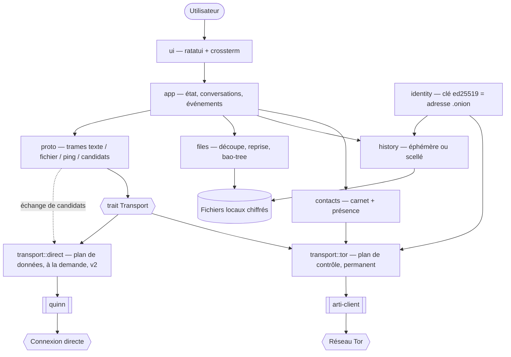

# INSTALL.md — murmure

Vision technique et guide d'installation.

**Date** : 2026-07-31
**Statut** : pile choisie et auditée, prête à coder
**Source amont** : `aidd_docs/brainstorm/2026_07_30-messagerie-pair-a-pair-terminal.md`

---

## Vision

> Messagerie terminal pair-à-pair chiffrée, sans serveur, sans compte, sans métadonnées centralisées.

murmure fait communiquer deux personnes qui se connaissent déjà, de machine à machine, sans
qu'aucun intermédiaire ne puisse lire les messages **ni savoir qui parle à qui**. C'est ce second
point qui définit le projet : le chiffrement de bout en bout est acquis partout, y compris chez
Signal et WhatsApp ; la confidentialité du **graphe social** ne l'est nulle part.

Le différenciateur tient en une phrase : aucune société ne peut fermer le service, le facturer,
ou changer ses conditions — parce qu'il n'y a pas de service, seulement deux machines et un
réseau public. Cible : cercles d'amis techniques, moins de dix utilisateurs, coût nul et
définitif.

---

## Decisions

| Décision | Choix | Pourquoi |
| --- | --- | --- |
| Architecture | Monolithe, **une seule crate binaire**, avec un trait `Transport` à deux implémentations | Un développeur solo, moins de dix utilisateurs. La seule abstraction posée est celle du transport, parce qu'il y aura réellement deux implémentations — pas une interface spéculative. |
| **Séparation contrôle / données** | **Tor porte le contrôle, un canal direct porte les données** | Le débit de Tor (0,1-0,25 Mo/s) est sans conséquence pour du texte et rédhibitoire pour des fichiers. Découpler les deux permet de payer le prix de l'anonymat là où il sert, et pas ailleurs. Restaure l'échelle à trois chemins du brainstorm. |
| Langage | **Rust** (MSRV 1.91) | Seul langage maîtrisé qui donne à la fois l'écosystème Tor natif, un binaire unique multi-OS, et pas de runtime à installer chez le correspondant. |
| Interface | **ratatui + crossterm**, TUI | Exigence « mode texte riche, pas de fenêtre graphique ». crossterm couvre Windows, ce qui répond à la réserve posée sur cet OS. |
| Transport — plan de contrôle | **arti** — service onion Tor v3 (`arti-client`, feature `onion-service-service`) | Le seul des trois candidats qui ne trahit pas l'objectif métadonnées. Supprime aussi entièrement le problème du NAT, y compris en 4G/CGNAT. Porte la découverte, l'authentification, la présence et **tout le texte**. |
| Transport — plan de données | **`quinn`** (QUIC brut), à la demande, **v2** | Pour les fichiers et images uniquement. Les candidats s'échangent par le canal Tor déjà authentifié, puis connexion directe à pleine vitesse. Échec ⇒ repli sur Tor, lent mais fonctionnel. |
| Annuaire identifiant → adresse | **Annuaire distribué de Tor (HSDir)** | Résout la dernière inconnue technique du brainstorm sans rien héberger. Les descripteurs v3 sont chiffrés en aveugle : un répertoire ne peut pas énumérer les services qu'il relaie. |
| Identité | **Clé ed25519 = adresse `.onion` v3**, graine de 32 octets possédée par murmure, déposée dans le keystore arti (`ArtiNativeKeystore`) | L'exigence « identifiant dérivé de la clé, inusurpable » n'est pas à implémenter : c'est la définition de l'adresse onion v3. ✅ Tranché le 2026-07-31 : murmure **fournit** sa clé à arti via `launch_onion_service_with_hsid`, il ne la lit pas. Voir « La propriété de la clé d'identité — tranchée ». |
| Authentification du correspondant | **Restricted discovery** (Arti ≥ 1.7.0), clés client **x25519** | Un service onion authentifie le serveur mais pas le client. La restricted discovery restreint jusqu'à la *récupération du descripteur* aux seuls contacts autorisés : « entre amis uniquement » devient une propriété du transport. |
| Intégrité des transferts | **`bao-tree`** (streaming vérifié BLAKE3, séparable d'iroh) | Permet de vérifier chaque bloc *à l'arrivée* contre le hash racine, au lieu de tout jeter à la fin. Avec un débit de 0,1 Mo/s sur circuits recyclables, ce n'est pas un confort mais une nécessité. |
| Chiffrement du canal | **Aucune couche ajoutée** — celui de Tor (ntor v3) | Décision délibérée. Empiler du Noise sur un circuit onion ajoute une surface d'erreur sans gain : la crypto maison est exclue, et une composition maison de primitives auditées en est une forme. |
| Stockage local | **Fichiers chiffrés `chacha20poly1305`**, pas de SGBD | Carnet de moins de dix contacts et un historique par conversation. SQLite serait une dépendance pour ce qu'un fichier scellé fait. |
| Hébergement | **Aucun** — le réseau Tor, 0 €/mois définitivement | Contrainte dure. Aucun serveur opéré, aucun compte, aucune facture possible. |
| Distribution | Binaire unique **et** `cargo install` | Rust rend l'arbitrage sans objet : les deux sortent de la même compilation. |

---

## Stack summary

| Couche | Crate / techno | Version au 31/07/2026 |
| --- | --- | --- |
| Transport contrôle & annuaire | `arti-client` (features `onion-service-service`, `onion-service-client`, `experimental-api`, plus `restricted-discovery` à venir) | **0.44.0** (30 juin 2026) |
| Transport données (v2) | `quinn` | 0.11+ |
| Runtime async | `tokio` | 1.x |
| Interface terminal | `ratatui` + `crossterm` | ratatui 0.29+ / crossterm 0.29 |
| Identité | `ed25519-dalek` | 2.2 |
| Chiffrement au repos | `chacha20poly1305` | 0.10 |
| Intégrité des fichiers | `bao-tree` (+ `blake3`) | 1.x |
| Sérialisation du protocole | `serde` + `postcard` | 1.x / 1.x |
| Compilateur | Rust stable | **≥ 1.91** (MSRV imposé par arti 0.44) |

**Intégrations externes** : le réseau Tor, et rien d'autre. Aucun service payant, aucun compte
tiers, aucun serveur à opérer.

> ⚠️ **Épingler strictement les versions arti.** Les crates arti sont en `0.x` avec une cadence de
> publication **mensuelle** et des cassures d'API à chaque montée. Écrire `arti-client = "=0.44.0"`,
> pas `"0.44"`. Prévoir une demi-soirée de migration à chaque montée volontaire.

> ⚠️ **Coût de migration connu : `experimental-api`.** Le jalon keystore a forcé deux features
> supplémentaires sur `arti-client` — `onion-service-client` (indispensable pour composer une
> adresse `.onion`) et **`experimental-api`**, qui seule expose
> `launch_onion_service_with_hsid`. Une feature expérimentale n'offre aucune garantie de
> stabilité, même entre deux versions mineures : elle peut disparaître ou changer de signature à
> la prochaine montée. La dette est bornée à dessein — un seul appel, dans une seule fonction
> (`transport::tor::launch_with_identity`), documentée comme point de bascule vers la route B, qui
> n'utilise que de l'API stable (`ArtiNativeKeystore`, `KeyMgrBuilder`, `KeyMgr::insert`,
> `launch_onion_service`). À chaque montée d'arti : vérifier cet appel en premier.
>
> Ni l'une ni l'autre de ces features n'a ajouté de crate au graphe : `tor-hsclient` et
> `tor-hscrypto` étaient déjà résolus. Les features expérimentales d'arti sont de simples features
> cargo — aucun `RUSTFLAGS`, aucun `--cfg`, aucun `.cargo/config.toml`.

---

## Architecture



La frontière structurante passe entre `proto` et `transport`. `proto` ne connaît que des trames
sérialisées et un pair identifié ; les implémentations de `Transport` ne connaissent que des
octets et une adresse. C'est la seule abstraction posée dans ce projet, et elle l'est parce qu'il
y aura réellement deux implémentations — pas une interface à implémentation unique.

**Le plan de contrôle Tor est permanent et porte tout** : découverte, authentification, présence,
messages texte, et la négociation du plan de données. **Le plan de données direct est ouvert à la
demande, uniquement pour les fichiers**, puis refermé. Cette asymétrie est le cœur de
l'architecture : le prix de l'anonymat est payé là où il ne coûte rien (quelques centaines
d'octets par message) et évité là où il fait mal (des mégaoctets).

`identity` est la racine : la clé ed25519 produit l'adresse `.onion`, donc l'identifiant public.
Perdre la machine reste perdre l'identité, conformément à l'hypothèse posée au brainstorm.

### La propriété de la clé d'identité — tranchée

> ✅ **Réserve levée le 2026-07-31, en code et en exécution.** Le programme **peut** fournir sa
> propre clé ed25519 à arti. `identity` reste donc la racine de l'architecture telle qu'elle est
> dessinée ci-dessus : murmure possède la graine, arti n'en est que le consommateur. La branche
> alternative — inverser la dépendance et *lire* la clé depuis le keystore — est abandonnée.

**L'API.** `TorClient::launch_onion_service_with_hsid(config, id_keypair: HsIdKeypair)`
(`arti-client-0.44.0/src/client.rs:1998`), derrière les features `onion-service-service` +
`experimental-api`. Elle appelle
`KeyMgr::insert::<HsIdKeypair>(kp, &HsIdKeypairSpecifier::new(nickname), KeystoreSelector::Primary, false)`
puis délègue à `launch_onion_service`. Le `false` est un `overwrite` : arti **refuse d'écraser**
une clé existante, exactement le comportement voulu.

**Pourquoi arti ne génère alors rien.** `tor_hsservice::maybe_generate_hsid`
(`tor-hsservice-0.44.0/src/lib.rs:586`) interroge d'abord `HsIdPublicKeySpecifier` et ne génère que
si la recherche est vide. `KeyMgr::get_from_store` (`tor-keymgr-0.44.0/src/mgr.rs:566-583`) se
rabat sur le spécificateur *keypair* quand la clé publique est absente. La clé insérée est donc
trouvée, et arti journalise `Using existing identity for service murmure` — vérifié à l'exécution.

**La chaîne de conversion**, entièrement dans les crates arti, sans code cryptographique maison :

```
[u8; 32] graine  ->  ed25519::Keypair  ->  ed25519::ExpandedKeypair  ->  HsIdKeypair
                                                                     ->  HsIdKey -> HsId (.onion)
```

`HsIdKeypair` est un newtype sur `ExpandedKeypair` (`tor-hscrypto-0.44.0/src/pk.rs:81`), et
`ExpandedKeypair: From<&ed25519::Keypair>` (`tor-llcrypto-0.44.0/src/pk/ed25519.rs:237`).

**La preuve retenue n'est pas une lecture de log** mais une comparaison d'octets : `identity.rs`
calcule l'adresse `.onion` localement à partir de la graine, sans jamais toucher au keystore, et le
programme avorte bruyamment si l'adresse publiée par arti en diffère.

**Route B, gardée en réserve.** Construire un
`ArtiNativeKeystore::from_path_and_mistrust(<state_dir>/keystore, permissions)` et un
`KeyMgrBuilder`, insérer sous `HsIdKeypairSpecifier`, puis appeler le `launch_onion_service`
non expérimental. arti-client construit son propre keystore exactement à `<state_dir>/keystore`
(`arti-client-0.44.0/src/client.rs:320-350`), les deux s'accordent donc sur le disque. Toute la
remise à niveau tient dans le corps d'une seule fonction, `transport::tor::launch_with_identity`.

**Un piège découvert à l'exécution.** `KeyMgr::insert` avec `overwrite = false` renvoie
`KeyAlreadyExists` dès que le keystore contient déjà une clé pour ce surnom — **y compris la
nôtre**, au second lancement. Ce n'est pas une erreur : `launch_with_identity` l'intercepte et
publie sur la clé stockée. C'est la comparaison d'octets, et elle seule, qui distingue « c'est bien
notre clé » de « quelqu'un d'autre occupe ce surnom ».

---

## Folder structure

```
murmure/
├── Cargo.toml                  # une seule crate, versions arti épinglées avec "="
├── src/
│   ├── main.rs                 # CLI, chargement config, boucle principale
│   ├── identity.rs             # clé ed25519, adresse .onion, keystore sur disque
│   ├── transport/
│   │   ├── mod.rs              # trait Transport — la seule abstraction du projet
│   │   ├── tor.rs              # arti : publie le service onion, ouvre les circuits sortants
│   │   └── direct.rs           # v2 — quinn, candidats reçus par le canal Tor
│   ├── proto.rs                # trames : texte, offre de fichier, chunk, ping, candidats
│   ├── contacts.rs             # carnet, empreintes courtes, clés de restricted discovery
│   ├── history.rs              # deux modes : rien conservé, ou scellé chacha20poly1305
│   ├── files.rs                # découpe en chunks, état de reprise, vérification BLAKE3
│   └── ui/
│       ├── mod.rs              # boucle de rendu ratatui, raccourcis clavier
│       ├── chat.rs             # zone conversation
│       └── contacts.rs         # zone carnet + indicateurs de présence
├── tests/
│   └── loopback.rs             # deux instances sur une machine, un message aller-retour
└── aidd_docs/
    ├── INSTALL.md
    └── brainstorm/
        └── 2026_07_30-messagerie-pair-a-pair-terminal.md
```

Pas de `packages/`, pas de `crates/`, pas de dossier vide « pour plus tard ». `transport/direct.rs`
n'existe qu'en v2 — il est listé ici pour montrer où il ira, pas pour être créé vide.

---

## Feuille de route des transports

Le débit de Tor est sans conséquence pour du texte et pénible pour des fichiers. Plutôt que de
tout construire d'emblée, l'échelle se monte par paliers, chacun livrable.

| Étape | Contenu | Ce que ça couvre | Effort |
| --- | --- | --- | --- |
| **v1** | **Tor seul.** Texte fluide, fichiers lents mais fonctionnels. | Tout le monde, partout, y compris 4G et CGNAT. | Le gros du travail |
| **v2** | **Chemin direct sans perçage de NAT.** Les deux pairs s'échangent leurs adresses candidates par le canal Tor déjà authentifié, puis tentent une connexion QUIC directe. Échec ⇒ repli silencieux sur Tor. | LAN, NAT full-cone, UPnP, et quiconque a une redirection de port. | Un week-end |
| **v3** | **Perçage de NAT** en ouverture simultanée temporisée. Réflexion d'adresse mutuelle : chacun renvoie par Tor l'adresse source qu'il a observée, à la manière d'ICE — aucun STUN, aucun tiers. | La majorité des NAT restrictifs. Jamais le NAT symétrique. | Là est la vraie difficulté |

Toute la complexité est concentrée en v3, et la v2 en est débarrassée. Ne pas la construire avant
d'avoir mesuré que le taux d'échec de la v2 gêne réellement.

**Ce qui rend ce montage possible sans aucun serveur** : le plan de contrôle Tor est déjà un canal
de signalisation authentifié entre les deux pairs. C'est précisément le service qu'un relais tiers
(iroh/n0, TURN, DERP) rend habituellement — donc l'ayant, on n'a plus besoin d'eux.

> **Rejeté explicitement** : auto-héberger un relais (`iroh-relay` sur une VPS) pour récupérer la
> découverte d'adresse publique. Cela réintroduit un serveur à opérer, un coût mensuel, et un point
> de panne unique — la contrainte que le projet existe pour supprimer.

> **Rejeté explicitement** : utiliser `iroh` avec `RelayMode::Disabled` comme plan de données. Une
> fois ses relais et sa découverte désactivés, il ne reste d'iroh que `iroh-blobs`, payé d'une
> seconde API en `0.x` posée sur une pile dont on neutralise la moitié des mécanismes. `bao-tree`
> seul donne la propriété recherchée — la vérification bloc par bloc — sans ce coût.

---

## Install steps

Installation manuelle — ce document ne génère aucun fichier.

1. **Installer Rust ≥ 1.91** : `rustup toolchain install stable && rustup default stable`, puis
   vérifier avec `rustc --version` (arti 0.44 impose 1.91 en MSRV).
2. **Initialiser la crate** : `cargo init murmure --bin` à la racine du dépôt existant.
3. **Ajouter les dépendances**, en épinglant arti à l'exact :
   `cargo add arti-client@=0.44.0 --features onion-service-service,restricted-discovery`
   puis `cargo add tokio --features full`, `cargo add ratatui crossterm ed25519-dalek chacha20poly1305 blake3 serde postcard`.
4. **Vérifier que la compilation passe sur les trois OS visés** avant d'écrire la moindre ligne de
   logique. arti tire une chaîne de dépendances conséquente ; découvrir un problème de
   compilation Windows après trois soirées de code coûte cher. À noter : docs.rs signale un échec
   de build pour `arti-client` 0.44.0 (0.43.0 est la dernière version qui y compile) —
   vraisemblablement un artefact de leur bac à sable, mais à confirmer par un `cargo build` local.
5. ~~**Trancher la question du keystore.**~~ ✅ Fait le 2026-07-31 : le programme fournit sa propre
   clé, `identity.rs` est bien la racine de l'architecture. Voir « La propriété de la clé
   d'identité — tranchée ».
6. ~~**Premier jalon exécutable.**~~ ✅ Franchi le 2026-07-31. `cargo run` publie le service onion
   sous une clé générée par murmure, affiche l'adresse `.onion`, et un second `TorClient` sur la
   même machine s'y connecte et reçoit son écho. Environ 9 s à froid sur un état déjà amorcé,
   23 s sur une machine vierge. Plan et critères d'acceptation :
   `aidd_docs/tasks/2026_07/2026_07_31-keystore-onion-milestone.md`.
7. **Second jalon** : le critère de réussite du brainstorm — deux machines, deux villes, comparaison
   d'empreinte à l'oral, un message, puis un fichier avec confirmation explicite.

---

## Audit summary

Résultat de l'audit mené à l'action 03.

| Candidat | Verdict | Note |
| --- | --- | --- |
| **A. iroh** (QUIC + hole punching + relais n0) | ⚠️ | `iroh-blobs` offre le transfert reprenable, mais le relais observe qui parle à qui — la métadonnée même que le projet existe pour cacher — et il est opéré par une société. |
| **B. rust-libp2p** (Noise + Kademlia + DCUtR) | ❌ | Une DHT à moins de dix nœuds ne fonctionne pas ; se rabattre sur la DHT publique IPFS publie le graphe social dans un annuaire mondial que des crawlers moissonnent et republient. |
| **C. arti / onion v3** | ⚠️ | **Retenu.** Tient l'objectif métadonnées, supprime l'inconnue de l'annuaire, annule le problème du NAT — au prix d'une latence de décrochage et d'un débit bien plus lourds qu'estimé initialement. Aucun bloqueur. |

**Périmètre de l'audit, honnêtement** : les candidats B et C ont fait l'objet d'un audit
indépendant mené par un agent, sources à l'appui. Le verdict A repose sur un jugement direct, non
audité — sans conséquence, puisque A est écarté sur un critère de conception (le relais observe le
graphe social) et non sur un point technique contestable.

Le verdict de C est passé de ✅ à ⚠️ après audit : les réserves sont réelles et chiffrées ci-dessous,
mais aucune n'est rédhibitoire, et le choix reste le seul des trois compatible avec la raison d'être
du projet.

### Ce que le NAT devient avec un service onion

Point de conception qui mérite d'être explicite, car il est contre-intuitif : **un service onion
n'accepte jamais de connexion entrante**. Le service ouvre des circuits *sortants* vers ses points
d'introduction, publie son descripteur *sortant*, et rejoint son correspondant sur un point de
rendez-vous que les deux atteignent *en sortant*. Les deux moitiés se rejoignent au milieu.

Conséquence : CGNAT, NAT symétrique, 4G/5G, wifi public, réseau d'entreprise — si du TCP sortant
passe, murmure passe. Le risque « le chemin direct ne marchera pas pour tout le monde » du
brainstorm disparaît, ainsi que tout besoin de traversée NAT, de hole punching et de relais de
secours. Seul un réseau bloquant Tor lui-même par inspection de paquets pose problème : le recours
est les bridges et les transports enfichables, qui se configurent manuellement.

### Ce que le choix C coûte, chiffré

Ces chiffres viennent de l'audit du 2026-07-31 et **corrigent une estimation initiale trop
optimiste** (1 à 3 s annoncés à tort). Ils pèsent sur le **plan de contrôle** ; le plan de données
direct (v2) les contourne pour les fichiers.

- **Décrochage : 7 à 50 s, 13 à 20 s en moyenne** (PETS 2025). Le circuit fait six relais — trois
  côté client, trois côté service, rendez-vous compris. C'est le coût d'ouverture d'une
  conversation, **pas** celui d'un message : une fois le circuit établi, les messages passent en
  sous-seconde. Le modèle « coup de fil » tient, mais la sonnerie est longue et la TUI doit
  l'afficher franchement plutôt que de paraître figée.
- **Débit : 0,1 à 0,25 Mo/s**, plafond ~0,5 dans les bonnes conditions. Le trafic onion-vers-onion
  souffre d'un contrôle de congestion moins abouti que le reste du réseau. Une photo de 5 Mo prend
  une minute, un fichier de 100 Mo prend une heure. En contrepartie, ce trafic ne traverse aucun
  nœud de sortie : il ne consomme pas la ressource rare et contestée de Tor, l'usage est légitime.
  **À relativiser** : un message texte fait quelques centaines d'octets, donc ce débit en fait
  passer plus d'un millier par seconde. La messagerie n'est pas bridée — seuls les fichiers le
  sont, et c'est ce que le plan de données direct (v2) vient corriger.
- **Circuits recyclables.** Tor applique ses propres politiques d'expiration et de rotation.
  Concevoir pour des reconnexions fréquentes, jamais pour un canal permanent. Combiné au débit
  ci-dessus, cela rend la reprise de transfert **structurellement obligatoire** — un transfert de
  quelques dizaines de Mo a de bonnes chances d'être interrompu au moins une fois.
- **Présence : aucun ping bon marché n'existe.** Savoir si un contact est joignable exige un
  circuit complet, donc 7 à 50 s par contact. L'« indicateur de présence dès la v1 » du brainstorm
  est bien plus cher que supposé. Piste : ne montrer la présence que pour les conversations déjà
  ouvertes (heartbeat applicatif sur circuit établi, gratuit), et remplacer le reste par une action
  « appeler » explicite. À trancher au design.
- **Premier contact plus lourd que prévu.** L'identifiant à échanger n'est pas seulement l'adresse
  `.onion` : la restricted discovery ajoute une clé client **x25519**, et l'échange est
  **asymétrique** — chacun doit inscrire la clé de l'autre dans ses `authorized_clients`. À
  vérifier que le tout reste comparable à l'oral sous forme d'empreinte courte.
- **Un seul chemin réseau en v1.** L'échelle direct → assisté → relayé du brainstorm devient une
  v2. Si Tor est bloqué sur le réseau de l'utilisateur, il faut passer par des bridges.

### Les deux pièges qui coûteront une soirée

Le piège historique numéro 1 — l'import d'une clé ed25519 personnalisée dans le keystore arti — est
levé depuis le 2026-07-31 ; il a coûté une soirée, comme prévu. Restent :

1. **L'absence de mécanisme de présence bon marché** — à budgéter dans l'UX de la TUI dès le
   départ, pas en rustine.
2. **Le débit combiné aux circuits recyclables** — la segmentation et la reprise doivent être dans
   la conception initiale de `files.rs`.

### Ce qui reste ouvert après ce document

- **La reprise de transfert entre sessions** : `bao-tree` fournit la vérification bloc par bloc,
  mais l'état du transfert partiel (quels blocs reçus, où le noter, comment le reprendre après
  redémarrage) reste à concevoir dans `files.rs`.
- **Le réglage du coût de la présence**, désormais chiffré comme le vrai problème d'UX du projet.
  Complication découverte au jalon keystore : `OnionServiceStatus::state()` **n'est pas un oracle
  de joignabilité**. L'état agrégé reste `Bootstrapping` dès que l'un des deux composants (gestion
  des points d'introduction, publication du descripteur) l'est encore
  (`tor-hsservice-0.44.0/src/status.rs:232`), et aucun accesseur public ne donne le détail par
  composant. Observé en conditions réelles : le descripteur est publié, le service répond aux
  connexions, et le statut annonce toujours `Bootstrapping`. **Ne pas brancher un indicateur de
  présence dessus** — il sous-déclare. La seule preuve de joignabilité est une connexion réussie,
  ce qui renchérit encore le coût de la présence.
- **La forme de l'identifiant échangé au premier contact** : adresse `.onion` + clé client x25519,
  échange asymétrique. À vérifier que l'empreinte courte reste comparable à l'oral.
- **Les vanguards ne sont pas activés.** La feature `vanguards` d'`arti-client` est absente de
  `Cargo.toml`. Sans elle, les chemins du service onion sont plus exposés à l'énumération des
  points d'introduction que ce qu'une mise en production demanderait. Hors périmètre du jalon
  keystore ; à trancher avant le second jalon (deux machines, deux villes).
- **Le coût de migration de `experimental-api`.** Voir la note de la section Stack summary.

---

## Sources

- [Arti 1.2.0 — `onion-service-service` rendu non-expérimental](https://blog.torproject.org/arti_1_2_0_released/)
- [Arti 1.7.0 — stabilisation de la restricted discovery](https://blog.torproject.org/arti_1_7_0_released/)
- [`arti-client` sur crates.io](https://crates.io/crates/arti-client)
- [`tor-hsservice` — implémentation côté service du protocole onion](https://docs.rs/tor-hsservice/latest/tor_hsservice/)
- [`tor_keymgr` — gestion des clés et keystore](https://tpo.pages.torproject.net/core/doc/rust/tor_keymgr/index.html)
- [PETS 2025 — Improving the Performance and Security of Tor's Onion Services](https://petsymposium.org/popets/2025/popets-2025-0029.pdf) (chiffres de latence)
- [Tor Metrics — OnionPerf latencies](https://metrics.torproject.org/onionperf-latencies.html)
- [`ratatui`](https://crates.io/crates/ratatui) · [`ed25519-dalek`](https://crates.io/crates/ed25519-dalek) · [`chacha20poly1305`](https://crates.io/crates/chacha20poly1305)
