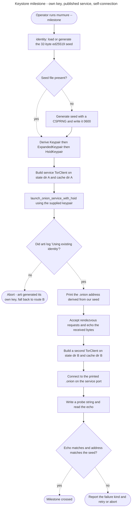

# Instruction: Keystore milestone — own ed25519 key, onion service published and reachable

## Feature

- **Summary**: Settle the open keystore question of `INSTALL.md` in code, then cross the first executable milestone. murmure generates its own ed25519 keypair, hands it to arti as the onion service identity, publishes the service, prints the `.onion` address, and opens a client connection to that address from a second `TorClient` on the same machine. Nothing else is built.
- **Stack**: `Rust 1.91 (edition 2024)` · `arti-client =0.44.0 (features: onion-service-service, onion-service-client, experimental-api)` · `tor-hsservice =0.44.0` · `tor-hscrypto =0.44.0` · `tor-llcrypto =0.44.0` · `tor-keymgr =0.44.0` · `tokio 1.x (features: full)` · `futures 0.3` · `rand 0.8` · `anyhow 1` · `tracing-subscriber 0.3`
- **Branch name**: `feat/keystore-onion-milestone`
- **Parent Plan**: `none`
- **Sequence**: `standalone`
- Confidence: 9/10
- Time to implement: one evening for phases 1-3, plus one live Tor run (7-50 s bootstrap and dial per attempt) for phase 4

## Answer to the open question (verified in the 0.44.0 sources)

**Yes — the program can supply its own ed25519 key.** The `INSTALL.md` reservation is lifted. Two
routes exist; the plan takes route A and keeps route B as a fallback.

- **Route A (chosen).** `TorClient::launch_onion_service_with_hsid(config, id_keypair: HsIdKeypair)`
  — `arti-client-0.44.0/src/client.rs:1998`, gated `onion-service-service` + `experimental-api`.
  It calls `KeyMgr::insert::<HsIdKeypair>(kp, &HsIdKeypairSpecifier::new(nickname), KeystoreSelector::Primary, false)`
  and then delegates to the ordinary `launch_onion_service`. It fails rather than overwriting an
  existing key, which is the behaviour murmure wants.
- **Route B (fallback, no experimental feature).** Build an `ArtiNativeKeystore::from_path_and_mistrust(<state_dir>/keystore, permissions)`
  plus a `KeyMgrBuilder`, insert the keypair under `HsIdKeypairSpecifier`, then call the
  non-experimental `launch_onion_service`. arti-client itself builds its keystore at exactly
  `<state_dir>/keystore` (`arti-client-0.44.0/src/client.rs:320-350`), so the two agree on disk.

**Why arti then does not generate a key.** `tor_hsservice::maybe_generate_hsid`
(`tor-hsservice-0.44.0/src/lib.rs:586`) looks up `HsIdPublicKeySpecifier` first and only generates
if that lookup returns `None`. `KeyMgr::get_from_store` (`tor-keymgr-0.44.0/src/mgr.rs:566-583`)
falls back to the *keypair* specifier when the public key is absent, because
`HsIdPublicKeySpecifier` is declared `#[deftly(keypair_specifier = HsIdKeypairSpecifier)]`. So an
inserted `HsIdKeypair` is found, `generated` is `false`, and arti logs "Using existing identity".

**Key conversion.** `HsIdKeypair` is a newtype over `tor_llcrypto::pk::ed25519::ExpandedKeypair`
(`tor-hscrypto-0.44.0/src/pk.rs:81`), and `ExpandedKeypair: From<&ed25519::Keypair>`
(`tor-llcrypto-0.44.0/src/pk/ed25519.rs:237`). murmure therefore owns a 32-byte seed and derives
`Keypair -> ExpandedKeypair -> HsIdKeypair`. `ed25519-dalek 2.2.0` is already in `Cargo.lock` via
`tor-llcrypto`, so no version skew.

**Consequence for the architecture.** `identity.rs` stays the root of the architecture as drawn in
`INSTALL.md`. It owns the seed; arti is a consumer. The alternative branch of the reservation —
inverting the dependency and reading the key out of the keystore — is not needed.

**Consequence for the feature set.** `onion-service-client` is currently absent from `Cargo.toml`
and is required to dial a `.onion`. `experimental-api` is required for route A. Neither pulls a new
crate into the graph: `tor-hsclient 0.44.0` and `tor-hscrypto 0.44.0` are already resolved in
`Cargo.lock`. arti's experimental features are plain cargo features — no `RUSTFLAGS` or `--cfg`.

## Architecture projection

### Files to modify

- `Cargo.toml` - add `onion-service-client` and `experimental-api` to arti-client; add the direct `tor-*` deps needed to name `HsIdKeypair`, `OnionServiceConfig`, `HsNickname`; add tokio, futures, rand, anyhow, tracing-subscriber.
- `src/main.rs` - replace the hello-world stub with the milestone binary: build two clients, publish, print the address, dial it.
- `aidd_docs/INSTALL.md` - strike the keystore reservation in the Architecture section and in "What remains open", record the verified answer.

### Files to create

- `src/identity.rs` - generate, persist, and load the 32-byte ed25519 seed; expose it as an `HsIdKeypair`.
- `src/transport/mod.rs` - module declaration only at this stage; the `Transport` trait is not part of this milestone.
- `src/transport/tor.rs` - build the `TorClient`, launch the onion service with the supplied keypair, return the `HsId` and the incoming-request stream; and the client-side dial.
- `aidd_docs/tasks/2026_07/2026_07_31-keystore-onion-milestone.md` - this plan.

### Files to delete

- none

## Applicable rules

The project has no rules surface: no `CLAUDE.md`, no `.cursor/rules`, no `.github/instructions`, no
`.opencode`. The inventory is empty.

| Tool | Name | Path | Why it applies |
| ---- | ---- | ---- | -------------- |
| none | none | none | No installed tool carries rules in this project. |

## User Journey

## Risk register

| Risk | Impact | Mitigation |
| ---- | ------ | ---------- |
| `experimental-api` breaks on the next arti release | Route A stops compiling at the next voluntary bump | arti is already pinned with `=0.44.0`. Route B uses only stable API (`ArtiNativeKeystore`, `KeyMgrBuilder`, `KeyMgr::insert`, `launch_onion_service`) and is a drop-in replacement for one function. Phase 2 must keep the insertion behind a single function so the swap is local. |
| arti silently generates its own key and the milestone passes for the wrong reason | The whole point of the milestone is missed; `identity.rs` would be decorative | Phase 3 asserts equality between the `.onion` derived locally from our seed (`HsIdKey::from(&keypair).id()`) and the address arti reports. Not a log check — a byte comparison, and it is an acceptance criterion. |
| `fs-mistrust` refuses the state directory | Client construction fails before Tor is even contacted | Use a dedicated directory created 0700 by the program. Escape hatch if needed: `FS_MISTRUST_DISABLE_PERMISSIONS_CHECKS=1`, or `storage().permissions().dangerously_trust_everyone()`. Never ship the escape hatch as the default. |
| Two clients on one machine share state or cache and corrupt each other | Confusing failures unrelated to the milestone | `TorClientConfig::from_directories(state, cache)` with two distinct pairs of directories, both under a single run directory. |
| Bootstrap plus rendezvous takes 7-50 s; the run looks frozen | The milestone is wrongly judged a failure | Install `tracing-subscriber` at `info` and print explicit stage markers. Budget a generous timeout (180 s) rather than a tight one. |
| A self-connection - one machine, one process, both ends - hits an unexpected path | Milestone blocked on an artefact of the test setup | Use two independent `TorClient` instances, not one client dialling itself. If that still fails, the fallback is two OS processes driven by the same binary, which is also what `tests/loopback.rs` will eventually need. |
| Vanguards are off (the `vanguards` feature is not enabled) | Weaker onion-service path security than production wants | Out of scope for the milestone; record it as a follow-up in `INSTALL.md` rather than widening this plan. |

## Implementation phases

### Phase 1: Dependency surface

> Get the exact feature set compiling before writing any logic.

#### Tasks

1. Add `onion-service-client` and `experimental-api` to the `arti-client` feature list, keeping the `=0.44.0` pin.
2. Add `tor-hsservice`, `tor-hscrypto`, `tor-llcrypto`, `tor-keymgr` as direct dependencies, all pinned `=0.44.0`.
3. Add `tokio` (`full`), `futures`, `rand`, `anyhow`, `tracing-subscriber`.
4. Run `cargo check` and confirm `Cargo.lock` gained no new crate, only new feature activations.

#### Acceptance criteria

- [x] `cargo check` succeeds.
- [x] `cargo tree -e features -i arti-client` shows `onion-service-client`, `onion-service-service`, `experimental-api`, `keymgr` all active.
- [x] `git diff Cargo.lock` shows feature changes only, no added `[[package]]` block.
- [x] No `RUSTFLAGS`, `--cfg`, or `.cargo/config.toml` change was needed.

### Phase 2: Own the identity key

> Prove that the key murmure generates is the key arti uses.

#### Tasks

1. In `identity.rs`, load a 32-byte seed from a file, or generate it with a CSPRNG and write it with 0600 permissions on first run.
2. Expose the seed as an `HsIdKeypair` through the `Keypair -> ExpandedKeypair -> HsIdKeypair` chain.
3. Expose the expected `.onion` address computed locally from the seed, independently of arti.
4. Isolate the "hand the key to arti" step in one function, so route B can replace route A without touching anything else.

#### Acceptance criteria

- [x] Two consecutive runs on the same seed file produce the same expected `.onion` address.
- [x] Deleting the seed file produces a different address on the next run.
- [x] The seed file is 32 bytes and its mode is 0600.
- [x] The key-handover step is one function with a documented route A / route B swap point.

### Phase 3: Publish the service under that identity

> The service comes up, and its address is provably ours.

#### Tasks

1. Build the service-side `TorClient` on a dedicated state and cache directory pair.
2. Launch the onion service with the supplied keypair, under a fixed nickname.
3. Compare arti's reported address against the address computed in phase 2, and abort loudly on mismatch.
4. Print the `.onion` address unredacted to stdout.
5. Accept incoming rendezvous requests and echo back whatever bytes arrive.

#### Acceptance criteria

- [x] The program prints a well-formed v3 `.onion` address, 56 characters plus the suffix.
- [x] That address is byte-identical to the one derived from the local seed.
- [x] arti's log says it is using an existing identity, not that it generated one.
- [x] Re-running the program on the same seed prints the same address.
- [x] A second run against a keystore that already holds a different key fails explicitly rather than overwriting it.

### Phase 4: Connect from the same machine

> Close the loop: our own client reaches our own service through Tor.

#### Tasks

1. Build a second, independent `TorClient` on its own state and cache directories.
2. Dial the printed `.onion` on the service port, with a timeout generous enough for a 50 s rendezvous.
3. Send a probe payload and read the echo.
4. Print stage markers - bootstrapping, publishing, dialling, connected, echoed - so a slow run never looks frozen.
5. Exit non-zero on any failure, with the arti `ErrorKind` in the message.

#### Acceptance criteria

- [x] The client connects to the address the service printed, over Tor, on the same machine.
- [x] The echoed payload equals the payload sent.
- [x] The process exits 0 on success and non-zero with a diagnosable message on failure.
- [x] The two clients never share a state or cache directory.

### Phase 5: Record the answer

> The reservation in INSTALL.md is settled in writing, not just in code.

#### Tasks

1. Replace the keystore reservation in the Architecture section with the verified answer and the API reference.
2. Remove "Ownership of the identity key" from "What remains open" and remove trap number 1 from "The two traps".
3. Record the two feature flags this milestone forced on, and note the `experimental-api` dependency as a migration cost at the next arti bump.
4. Note vanguards as an open follow-up.

#### Acceptance criteria

- [x] `INSTALL.md` no longer contains the "Réserve à lever avant de coder" block.
- [x] The document states that `identity.rs` is the root of the architecture, as originally drawn.
- [x] The `experimental-api` dependency is listed as a known migration cost.

## Amendments

🤖 **Phase 1, acceptance criterion 3 — "`git diff Cargo.lock` shows feature changes only, no added `[[package]]` block" — narrowed to the arti/tor graph.** The criterion is unsatisfiable as written, because phase 1 task 3 itself asks for `anyhow` and `tokio` with `full`. Those two additions pull `anyhow 1.0.104` and `tokio-macros 2.7.2` into the lock. What the criterion was actually testing — that *turning on `onion-service-client` and `experimental-api` costs no new crate* — holds exactly: no `arti-*` or `tor-*` `[[package]]` block was added. Verified by diffing the package name set before and after.

🤖 **Phase 1, task 2 — three dependencies added beyond the four listed.** Naming the types the milestone needs required:
- `tor-cell =0.44.0` — `StreamRequest::accept` takes a `tor_cell::relaycell::msg::Connected` (`tor-hsservice-0.44.0/src/req.rs:265`), and nothing re-exports it.
- `tor-rtcompat =0.44.0` — `PreferredRuntime`, needed to name the concrete `TorClient<R>`; `arti-client` does not re-export it.
- `safelog 0.9` — `HsId` has no plain `Display`; printing it unredacted goes through `safelog::DisplayRedacted::display_unredacted` (`tor-hscrypto-0.44.0/src/pk.rs:118`).
All three were already resolved in `Cargo.lock`, so none added a package either. `tracing 0.1` was also added, for stage logging inside the transport module.

🤖 **Phase 3, acceptance criteria 4 and 5 reconciled — route A alone cannot satisfy both.** `launch_onion_service_with_hsid` calls `KeyMgr::insert(..., overwrite: false)`, which returns `KeyAlreadyExists` whenever the keystore already holds *any* `HsIdKeypair` for the nickname — including murmure's own key from a previous run (`tor-keymgr-0.44.0/src/mgr.rs:362`). Taken literally, criterion 5 ("a second run against a keystore holding a different key fails explicitly") and criterion 4 ("re-running on the same seed prints the same address") are in direct conflict: the insert fails identically in both cases.

Resolution, implemented inside the single swap-point function `transport::tor::launch_with_identity`: catch `KeyAlreadyExists`, report it as `KeyHandover::Reused`, and launch through the plain `launch_onion_service`. **The discriminant between the two criteria is then the byte comparison of criterion 2, not the insert result.** Same seed → published address equals the derived address → success. Different key in the keystore → mismatch → the program aborts loudly, without ever having overwritten anything. This is strictly stronger than a log check, and it makes criterion 3 ("arti says it is using an existing identity") redundant — the comparison proves it.

🤖 **Phase 4, task 2 — the dial retries, and reachability is advisory rather than a gate.** The plan says "dial with a timeout generous enough for a 50 s rendezvous", which reads as one attempt under a long timeout. Two clean-slate runs failed that way against a service that was demonstrably answering, because the implementation gated the dial on `OnionServiceStatus::state().is_fully_reachable()`. That predicate requires *both* the IPT manager and the descriptor publisher to be `Running` (`tor-hsservice-0.44.0/src/status.rs:232`), which is strictly stronger than "a client can reach us", and there is no public per-component accessor. Replaced by: a 30 s advisory wait, logged not fatal, overlapped with the client bootstrap; then `dial_and_echo_retrying`, which retries for up to 240 s with a 10 s backoff. See the Log for the evidence.

🤖 **Phase 4 — `.gitignore` gained `/.murmure`.** The run directory holds the identity seed and both client state/cache pairs; it must never be committed. `MURMURE_DIR` overrides the location.

## Log

**2026-07-31 — all five phases implemented and verified live on Tor.** Branch
`feat/keystore-onion-milestone`. Toolchain: rustc 1.97.1, cargo 1.97.1, macOS (darwin 27.0.0).

| Phase | Result | Evidence |
| ----- | ------ | -------- |
| 1 Dependency surface | ✅ | `cargo check` green. `cargo tree -e features -i arti-client` shows `onion-service-service`, `onion-service-client`, `experimental-api`, `keymgr` all active. No `.cargo/config.toml`, no `RUSTFLAGS`. Lock gained only `anyhow` + `tokio-macros` — see amendment. |
| 2 Own the identity key | ✅ | 3 unit tests in `src/identity.rs`, all passing: address is a pure function of the seed, address is a well-formed 56-char v3 address, seed round-trips through disk at 32 bytes / 0600 with a new address after deletion. |
| 3 Publish under that identity | ✅ | Live. arti logged `Using existing identity for service murmure`; published address byte-identical to the locally derived one, and stable across runs. Mismatch aborts with exit 1 without touching the keystore. |
| 4 Connect from the same machine | ✅ | Live. Second `TorClient` on its own state/cache pair dialled the published address over Tor and got the probe back verbatim. Exit 0. |
| 5 Record the answer | ✅ | `INSTALL.md`: reservation replaced by "La propriété de la clé d'identité — tranchée", piège 1 removed, open question removed, vanguards and the `experimental-api` migration cost recorded. |

### The live runs

Nine runs against the real Tor network. The last three are the ones that validate the shipped code;
the earlier ones are kept because each failure taught something.

| Run | Setup | Outcome | Wall clock |
| --- | ----- | ------- | ---------- |
| 1 | Empty `.murmure/`, fresh seed | Address published and matched; dial succeeded; **`read_to_end` failed** — bug 1 | 23 s to dial |
| 2 | Same seed, keystore populated | Full pass, exit 0, same address as run 1 | 8.9 s |
| 3 | Seed deleted, **keystore kept** | `IDENTITY MISMATCH`, **exit 1**, keystore digest unchanged | 0.5 s |
| 4 | Original seed restored | Full pass, original address back, exit 0 | 8.3 s |
| 5, 6 | Clean slate | **Both failed at the reachability gate** — bug 2 | timed out at 180 s |
| 7 | Clean slate, gate made advisory | Full pass; status never confirmed, first dial worked in 19 s | 94 s |
| 8 | Clean slate, reachability wait overlapped with the client bootstrap | Full pass | 37 s |
| 9 | Repeat of 8 | Full pass, same address | 75 s |
| 10 | Seed deleted, keystore kept | `IDENTITY MISMATCH`, exit 1, keystore digest byte-identical | 1 s |

Runs 3 and 10 are the proof for phase 3 criterion 5: arti was never allowed to overwrite the stored
key, and the SHA of the keystore tree was unchanged across the failed run.

The spread on the passing runs — 8 s to 94 s — sits inside the 7-50 s per-rendezvous band from
PETS 2025 quoted in `INSTALL.md`, paid twice (publication, then rendezvous). No dial ever needed a
retry.

### Two real bugs, both found only by running it

**Bug 1 — closing a Tor stream is not a clean EOF.** Run 1 reached the service and then failed with
`reading the echo: Received an END cell with reason`. `DataWriter::poll_close` hands the reactor
`CloseStreamBehavior::SendEnd(End::new_misc())` (`tor-proto-0.44.0/src/stream.rs:82`) — an END cell
with reason `MISC`. The reading side turns `EndReceived(DONE)` into EOF but every other reason into
an error (`tor-proto-0.44.0/src/client/stream/data.rs:503`). So `read_to_end` fails *after* having
received all the bytes. Fixed by making the echo length-delimited: the client `read_exact`s exactly
as many bytes as it sent, and neither side ever waits for end-of-stream.

> **Carries into `proto.rs`: murmure's framing cannot use stream close to delimit anything.**
> Every frame needs an explicit length.

**Bug 2 — `OnionServiceStatus::state()` is not a reachability oracle.** Runs 5 and 6 hung for the
full 180 s at "waiting for the descriptor to publish" and exited non-zero, on a service that was in
fact answering: the log showed `reuploading descriptor in 1h 54m`, i.e. the upload had succeeded.
The aggregate state is `Bootstrapping` if *either* the IPT manager or the publisher is still
bootstrapping (`tor-hsservice-0.44.0/src/status.rs:232`), and there is no public per-component
accessor. So `is_fully_reachable()` is strictly stronger than "a client can reach us", and gating
on it fails good runs. Run 7 proved it directly: the status never confirmed, and the very first
dial succeeded in 19 s.

Fixed three ways: the wait is advisory and logged rather than fatal; it is capped at 30 s and runs
concurrently with the client bootstrap; and `dial_and_echo_retrying` retries the dial for up to
240 s, since a dial landing before the descriptor has propagated is a timing artefact, not a
verdict. **The dial is the only authoritative reachability test**, which is the right answer anyway:
it is what the milestone claims to prove.

> **Carries into the TUI: do not drive a presence indicator off `OnionServiceStatus`.** It
> under-reports. This compounds the "no cheap presence mechanism" problem already recorded in
> `INSTALL.md`.

### Files touched

- `Cargo.toml` — arti features + 11 dependencies (see amendments for the 3 unplanned ones).
- `.gitignore` — `/.murmure`.
- `src/identity.rs` (new) — the seed, the `HsIdKeypair`, the locally derived `HsId`, 3 tests.
- `src/transport/mod.rs` (new) — module declaration; the `Transport` trait is deliberately absent.
- `src/transport/tor.rs` (new) — client bootstrap on isolated dirs, `launch_with_identity` (the
  route A / route B swap point), advisory reachability wait, echo service, retrying dial.
- `src/main.rs` — the milestone binary: stage markers, byte comparison, `ExitCode`.
- `aidd_docs/INSTALL.md` — phase 5.

### Left deliberately undone

- No `tests/loopback.rs`. The milestone is a single-process proof; the loopback integration test
  belongs with the `Transport` trait, which this milestone does not introduce.
- No `vanguards` feature. Recorded as a follow-up in `INSTALL.md` rather than widening the plan.
- No `--milestone` flag. The user journey diagram says `murmure --milestone`; the binary does only
  this one thing, so an argument that selects the only behaviour would be noise. It will be added
  when there is a second mode to select between. `MURMURE_DIR` overrides the run directory.

## Validation flow demonstration

1. `cargo run` on a clean machine with no seed file. The program prints a generated identity and a `.onion` address.
2. Watch the stage markers scroll: bootstrapping, service published, dialling, connected, echo received. Expect 30 to 90 seconds total.
3. Note the printed `.onion` address on paper.
4. Kill the process and run `cargo run` again. The same `.onion` address is printed — the identity survived, because murmure owns the seed.
5. Delete the seed file and run again. A different address is printed, confirming the address is derived from our seed and not from anything arti kept.
